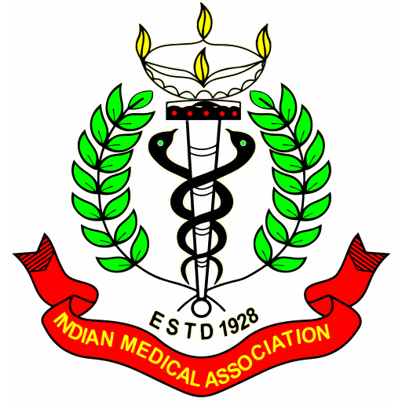
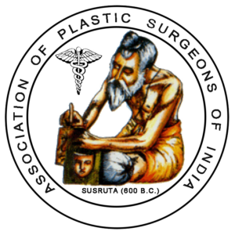
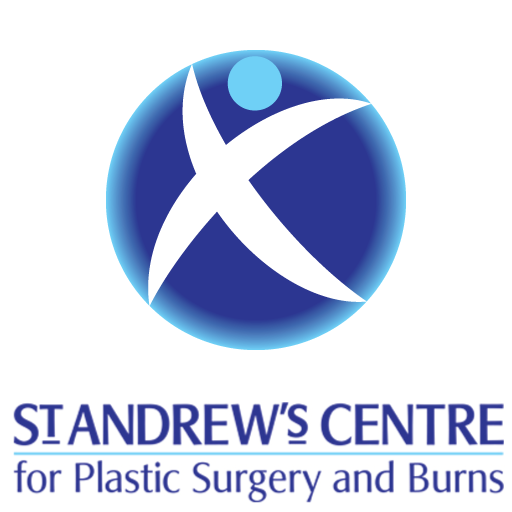

	

	

		

			

				

					

						<h2>Love of beauty is <b>Taste</b>. 
						The creation of beauty is <b>Art</b>.</h2>
						
&ensp;- Ralph Waldo Emerson

					

				

				

					

						
<h3><b>Taking care of your Appearance</b> 
						Anti Ageing has to start before the effect of age, gravity, hormones and nutritional imbalances take over.</h3>

						
<h3><b>Dr. Atulkumar Shah</b> 
						University qualified expert in the field of Cosmetology, Cosmetic Surgery, Anti Ageing and Plastic Surgery.</h3>

					

				

			

		

	

<!-- end:fh5co-hero -->

	

		

			

				

					<h2>Credentials</h2>
					
<b>Dr Atulkumar Shah is consultant in Cosmetic, Plastic, Reconstructive and Burns Surgery. 
					He is practicing in Vadodara (Baroda - BRC - BDQ). Active member and past President of Vadodara branch of Indian Medical Association, he was also Honorary Secretery of Association of Plastic Surgeons of India for 6 years from 2010 to 2015. 
					Here are University and Council recognized qualifications of Dr Atulkumar Shah.</b>

				

			

		

		

			

				<ul class="schedule">
					<li><a href="#" data-sched="memberships">Professional Memberships</a></li>
					<li><a href="#" data-sched="medical">Medical</a></li>
					<li><a href="#" data-sched="cosmetology">Cosmetology</a></li>
					<li><a href="#" data-sched="management">Management</a></li>
					<li><a href="#" data-sched="law">Law</a></li>
					<li><a href="#" class="active" data-sched="fellowships">Fellowships</a></li>
				</ul>
			

			

				

					

						

							

								
								<small>1982</small>
								<h3>MBBS</h3>
								<small>(Credit in Forensic Medicine)</small>
								The M S University of Baroda
							

						

						

							

								
								<small>1986</small>
								<h3>MS</h3>
								<small>(ORL)</small>
								The M S University of Baroda
							

						

						

							

								
								<small>1989</small>
								<h3>MCh</h3>
								<small>(Plastic &amp; Reconstructive Surgery)</small>
								The M S University of Baroda
							

						

					

					<!-- END sched-content -->
					

						

						

							

								
								<small>2009</small>
								<h3>MPhil</h3>
								<small>(Cosmetology)</small>
								The Global University
							

						

						

					

					<!-- END sched-content -->
					

						

						

							

								
								<small>2003</small>
								<h3>MPhil</h3>
								<small>(Hospital &amp; Health Systems Management)</small>
								The Birla Institute of Technology &amp; Science
							

						

						

					

					<!-- END sched-content -->
					

						

							

								
								<small>2003</small>
								<h3>PGDMLE</h3>
								<small>(Medical Law &amp; Ethics)</small>
								National Law School of India University
							

						

						

							

								
								<small>2005</small>
								<h3>LLB</h3>
								<small>(General)</small>
								The M S University of Baroda
							

						

						

							

								
								<small>2011</small>
								<h3>LLB</h3>
								<small>(Special)</small>
								The M S University of Baroda
							

						

						

							

								
								<small>2013</small>
								<h3>LLM</h3>
								<small>(Criminal Laws)</small>
								The M S University of Baroda
							

						

					

					<!-- END sched-content -->
					

						

							

								
								<h3> Indian Medical Association</h3>
								Life Member
							

						

						

							

								
								<h3>Association of Otolaryngologists of Inida</h3>
								Life Member
							

						

						

							

								
								<h3>Association of Plastic Surgeons of India</h3>
								Life Member
							

						

						

							

								
								<h3>All India Association for Advncing Research in Obesity</h3>
								Life Member
							

						

					

					<!-- END sched-content -->
					

						

							

								
								<h3>Shriner’s Hospital</h3>
								Galveston, TX, USA
							

						

						

							

								
								<h3>Shriner’s Hospital</h3>
								Sacramento, CA, USA
							

						

						

							

								
								<h3>Jaycee Burns Centre</h3>
								Chapel Hill, NC, USA
							

						

						

							

								
								<h3>Hospital for Sick Children</h3>
								Toronto, Ontario, Canada
							

						

						

							

								
								<h3>St. Andrews Centre for Plastic Surgery and Burns</h3>
								Chelmsford, Essex, UK
							

						

					

					<!-- END sched-content -->
				

			

		

	

<!-- end: fh5co-parallax -->